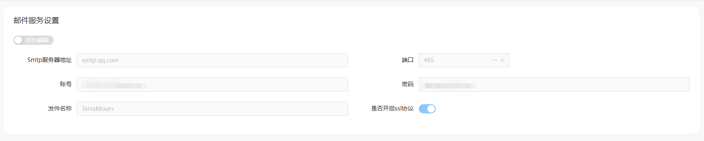
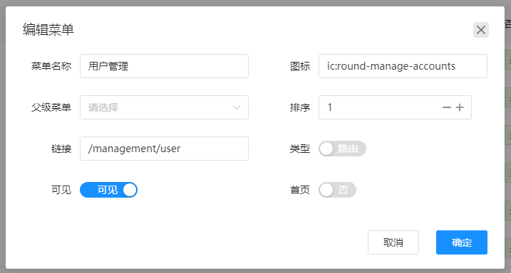
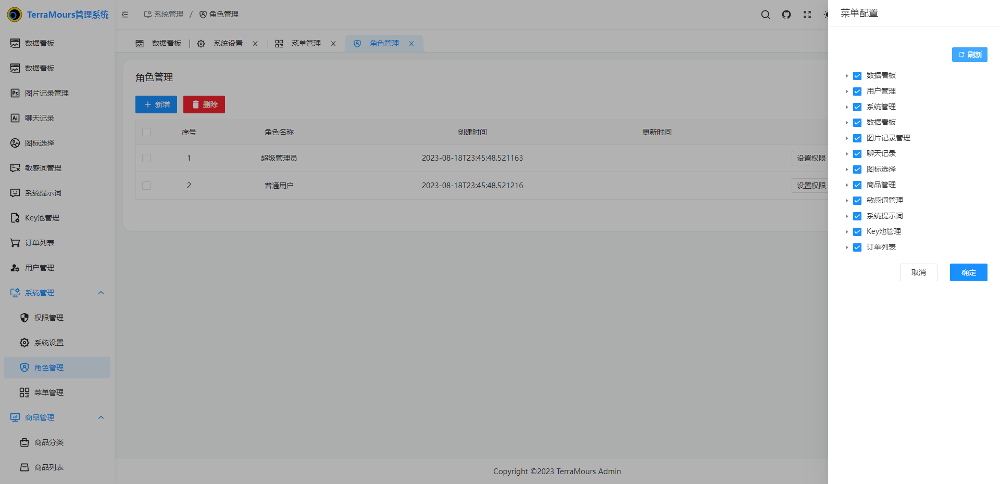
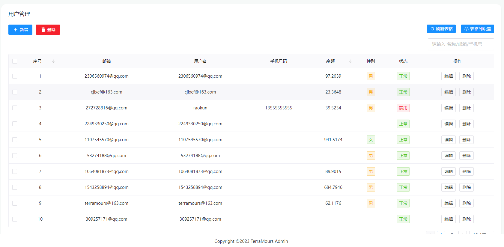
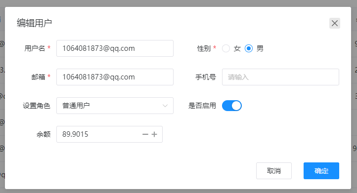
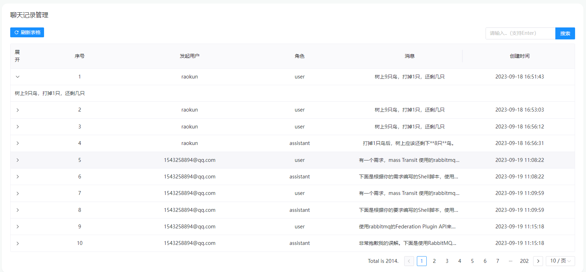
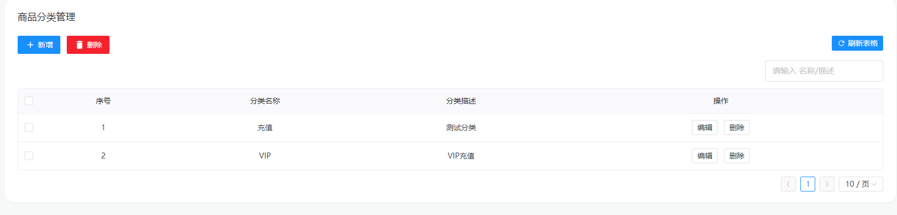
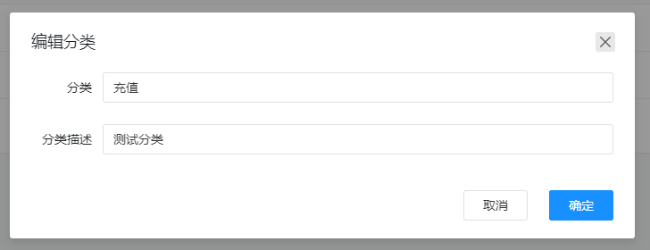
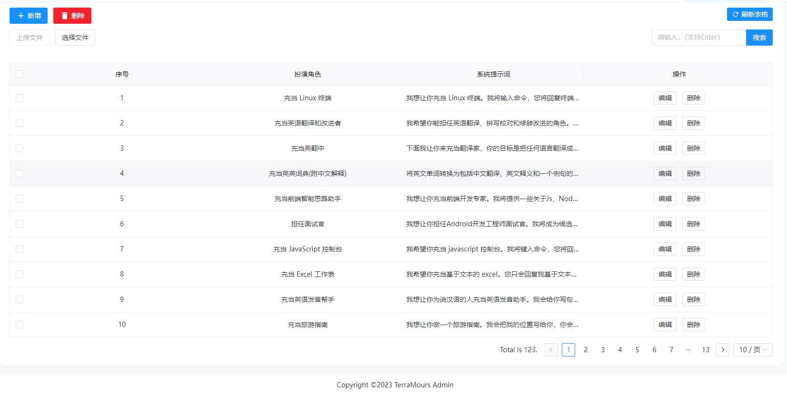

# System Management Function Introduction

## Introduction
TerraMours AI Management System is a real-world project that implements user login, multi-language model chat based on SK, and multi-model image generation based on chatgpt and SD. The management side includes data dashboard, chat record management, image record management, user management, and system configuration.

TerraMours Admin is a backend management system developed based on soybean-admin. The technology stack includes the latest popular frontend technologies such as Vue3, Vite3, TypeScript, NaiveUI, Pinia, and UnoCSS. It has rich theme configuration, high code standards, and is ready to use or can be used for learning and reference.

## 1. Dashboard

Displays multiple data statistics, including several types of data that managers are most concerned about.

Charts display statistics of chat and drawing counts from multiple dimensions, divided into three dimensions: today (segmented statistics by hour), daily statistics, and monthly statistics. The following is the data content for daily statistics.

## 2. System Settings

### 1. Email Service Configuration

Configure the API service parameters for the system email, used for sending email verification codes.

Please obtain the corresponding parameters from the corresponding email configuration.

### 2. GPT Settings

Configure the proxy address for GPT, GPT pricing plans, interface parameters, and KEY pool configurations.

- Proxy configuration includes regular call proxy and GPT4 proxy. Because the current GPT4 has higher audit requirements, you can separately configure the interface plan for GPT4.
- MaxTokens: Set the maximum value of the interface reply. Please set it according to the project requirements.
- Context Count: Set the default number of context for user use.
- Maximum Question Count: Set the maximum number of questions a user can ask per day. It is not recommended to leave it empty, as it can prevent malicious use.
- Key Pool Configuration: Set the key used for regular calls. A key pool consisting of multiple keys can ensure higher efficiency of GPT calls in the project.

### 3. Image Service Address

- Static File Address: Set the access URL for generated images.
- Image Pricing.
- Stable Diffusion Configuration: Configure the stable diffusion model type, API interface address, inverse descriptor, etc.

## 3. Menu Management

The backend management system implements dynamic configuration of menus. The menu management interface is used to set menus. The backend API will add basic menus during initialization.

### 1. List

### 2. Add/Modify

* Menu Name
* Icon
* Parent Menu: Selecting a parent menu sets it as the second-level menu. If not selected, it defaults to the first-level menu.
* Sorting
* Type: Route/External Link
* Link: For the route type, enter the relative path of the corresponding page; for the external link type, enter the URL address of the corresponding page.
* Visible: Controls whether the page is displayed.
* Home Page: Controls whether the page is displayed as the initial page when the system loads.

## 4. Role Management

Role control in the backend management system. By default, it creates super administrator and regular user roles.

### 1. List

### 2. Set Permissions

Click the "Set Permissions" button, and the currently configured menus will pop up on the right side. Check the corresponding items to control the menu viewing permission for the current role.

## 5. User Management

Manage users registered in the system.

### 1. List

Quickly view user information and user status.

### 2. Add/Edit

Complete the modification of user information.

**Note**: The default role and initial password for adding users in the management system can be configured in the API configuration file under "InitialRoleId" and "InitialPassWord" of the "Initial" section.

## 6. Chat Records

View chat records in the system.

Click to expand and view the complete message content.

## 7. Image Record Management

View records of generated images in the system.

Click to expand and view the corresponding image content.

Click "Public" to make it visible in the image gallery.

## 8. Product Management - Product Category

Set product types, classification, and other information for convenient product management.

### 1. List

### 2. Edit

## 9. Product Management - Product List

### 1. List

### 2. Add/Edit

Fill in different parameters based on different recharge types.

## 10. Order List

View users' purchased orders and payment status. Profit statistics can be viewed in the data dashboard.

## 12. Sensitive Word Management

Used to set sensitive words for chat questions, to avoid project issues raised by users asking sensitive questions.

### 1. List

### 2. File Import

Select to upload a file to quickly import a sensitive word library in bulk.

Template file address: [Template File](/files/terramours_sensitive.txt)

## 11. System Message

Used to set system prompts for chat questions, for user convenience.

### 1. List

### 2. File Import

Select "Upload File" to quickly import system prompt words in bulk.

Template file address: [Template File](/files/terramours_systemmessage.json)
