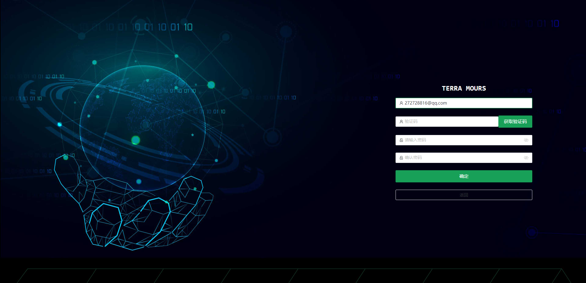
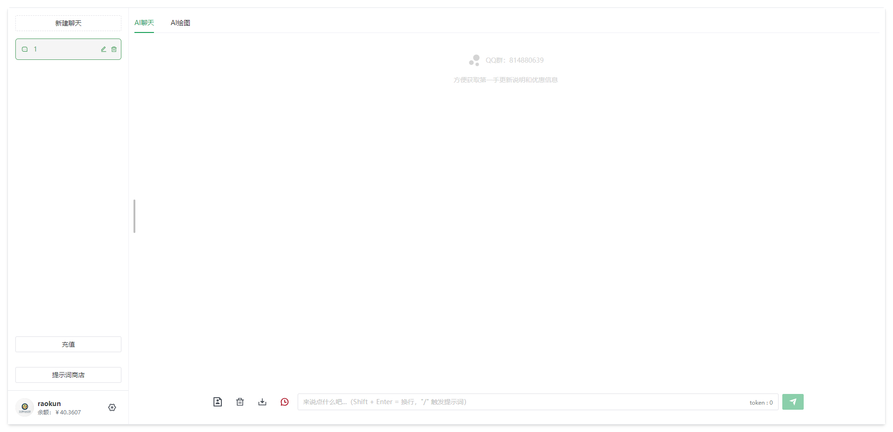
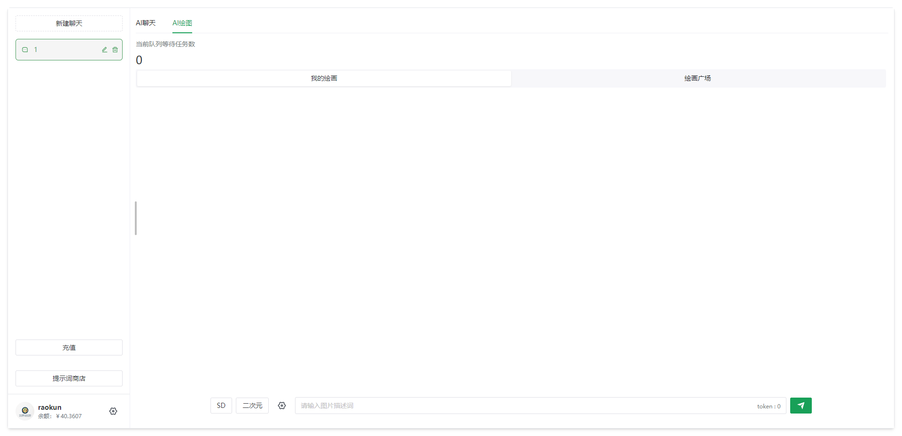
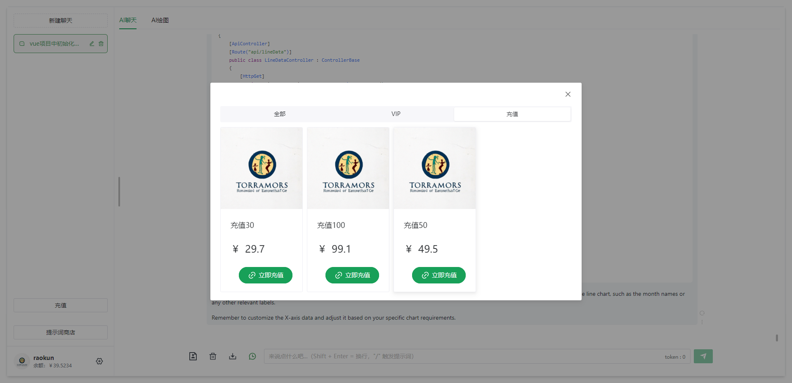
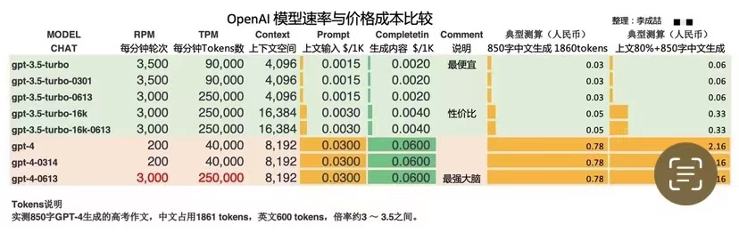

# 定制化前端项目

## 访问地址

访问地址：[https://first.terramours.site/](https://first.terramours.site/)

备用地址：[https://second.terramours.site/](https://second.terramours.site/)

也可在官网获取最新访问地址：[https://terramours.site/](https://terramours.site/)

## 介绍

目前界面还是沿用了之前使用的经典会话框风格

## 1.注册和登陆

点击注册跳转注册页面，输入邮箱地址，点击获取验证码，系统会向你所填邮箱发送一条验证码消息。

填写验证码和密码完成注册。

注册完成后，会跳转登陆页面，**如果页面卡住可以刷新页面**

## 2.使用

基本使用与之前版本相同

新增3.5 16k和gpt4的选项。

## 3.提示词

新增在线更新提示词功能

## 4.AI绘图

选择模型

绘画广场

## 5.充值

### VIP

### 余额充值

## 6.计费

### 聊天

目前可使用3.5和3.5 16K 模型（会员无限制），GPT4模型由于成本过大，目前只能余额计费使用

使用费用：

- GPT3.5  余额计费： 每1k字预计0.1，会员期间免费
- GPT3.5  余额计费： 每1k字预计0.2，会员期间免费
- GPT3.5  余额计费： 每1k字预计0.3

### 画图

目前可以使用CHATGPT和stable diffusion 两种AI产品。

使用费用：

- 0.14/张