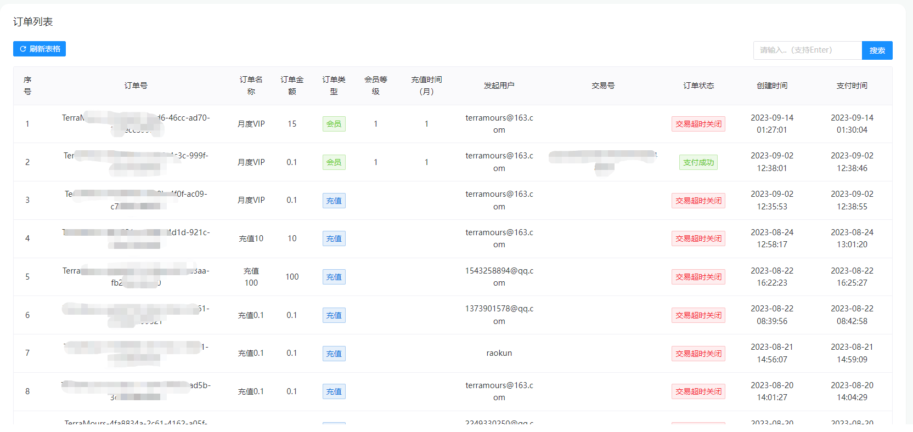

<div align="center">
	<h1>TerraMoursGpt2</h1>
</div>


 

中文简介 | [English](README-EN.md)

## 简介

TerraMoursGpt2 向量数据库+LLM模型 的知识库AI助手平台，支持gpt-4，支持gpt-4-version的图片分析。


## LLM模型
- [x] OpenAI 
- [x] chatGLM
- [x] 文心千帆
- [x] 同义千问
- [x] stable-diffusion
- [ ] midjourney


## 向量库

- [x] pinecone
- [X] pgvector


## 特点

**1.SignalR+Hangfire 实现后台任务队列和实时通讯**

**2.日志服务Seq**

**3.支持pgvector的本地向量库和pinecone云端向量库** 

**4.支持alipay支付**

**5.通过 AllInAI.Sharp.API 实现LLM模型的统一调度**

**6.定制化菜单管理**


## 功能

- **AI聊天**：支持gpt-4，支持gpt-4-version的图片分析
- **AI绘图**：支持stable-diffusion、 stable-diffusionXL、dallE
- **知识库**：支持pgvector的本地向量库和pinecone云端向量库 配置知识库（todo：文本转化方案）
- **数据看板**：数据统计分析
- **菜单配置**：提供根据角色配置菜单。精确管理应用
- **系统设置**：Key池管理，支持管理者添加多个key组成Key池，调用ai接口时轮询，加强稳定性
- **系统提示词**：系统提示词，添加各种角色提示词，让使用者能更好的使用ai对话。
- **聊天记录**：查看聊天记录
- **敏感词管理**: 敏感词管理，自定义敏感词过滤，加强系统安全
- **用户管理**：编辑，修改注册的用户
- **角色管理**：编辑，修改角色，配置角色菜单
- **商品管理**：新增编辑删除商品
- **充值中心**：用户充值或购买VIP页面
- **订单管理**：查看用户支付情况


## 在开始之前

**关注我们，您将立即收到 GitHub 上所有新发布版本的通知！**

* [在线地址](https://second.terramours.site/)
* [项目文档地址](https://terramours.site/guide/)
* [CHATGPT账号商店](https://sp.terramours.site/)
* [部署文档](https://terramours.site/guide/build.html)
* [常见问题](https://terramours.site/guide/qa.html)


## 安装社区版

### 系统要求

在安装 TerraMours 之前，请确保您的机器满足以下最低系统要求：

- CPU >= 1 Core
- RAM >= 2GB

### 快速启动

启动 TerraMours 服务器的最简单方法是运行我们的 [docker-compose.yml](Docker/docker-compose.yml) 文件。在运行安装命令之前，请确保您的机器上安装了 [Docker](https://docs.docker.com/get-docker/) 和 [Docker Compose](https://docs.docker.com/compose/install/)：

```bash
cd docker
docker compose up -d
```


### 配置

如果您需要自定义配置，请参考我们的 [docker-compose.yml](Docker/docker-compose.yml) 文件中的注释，并手动设置环境配置。更改后，请再次运行 `docker-compose up -d`。您可以在我们的[文档](https://terramours.site/guide/)中查看所有环境变量的完整列表。


## 社区与支持

我们欢迎您为 TerraMours做出贡献，以帮助改善 TerraMours。包括：提交代码、问题、新想法，或分享您基于 TerraMours创建的有趣且有用的 AI 应用程序。同时，我们也欢迎您在不同的活动、会议和社交媒体上分享 TerraMours。

- [GitHub Issues](https://github.com/TerraMours/TerraMoursGpt2/issues)。👉：使用 TerraMours 时遇到的错误和问题。
- [电子邮件支持](mailto:terramours@163.com?subject=[GitHub]Questions%20About%20TerraMoursGpt2)。👉：关于使用 TerraMours 的问题。
- [商业许可](mailto:terramours@163.com?subject=[GitHub]Business%20License%20Inquiry)。👉：有关商业用途许可 TerraMours 的商业咨询。
 - [微信]() 👉：扫描下方二维码，添加微信好友，备注 TerraMours，我们将邀请您加入 TerraMours 社区。  
   


## 项目截图





## 开源作者

[@Raokun](https://github.com/raokun)

[@firstsaofan](https://github.com/orgs/TerraMours/people/firstsaofan)


## License

This repository is available under the [TerraMoursGpt2 Open Source License](LICENSE), which is essentially Apache 2.0 with a few additional restrictions.

