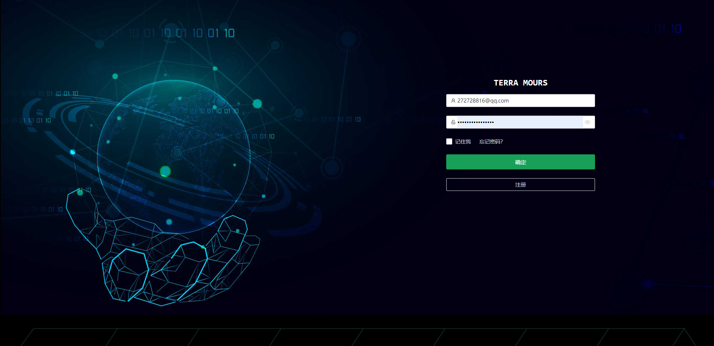

<div align="center">
	<h1>TerraMours_Admin_Web</h1>
</div>


[](./LICENSE)  

中文简介 | [English](README-EN.md)

## 简介

[TerraMours Admin](https://github.com/TerraMours/TerraMours_Admin_Web) 是基于soybean-admin 开发完善的后台管理系统，技术包括 Vue3、Vite3、TypeScript、NaiveUI、Pinia 和 UnoCSS 等最新流行的前端技术栈，内置丰富的主题配置，有着极高的代码规范，开箱即用，也可用于学习参考。

TerraMours实战项目，实现用户登陆和基于SK的多语言模型聊天、基于chatgpt和SD的多模型图片生成等功能。管理端实现数据看板、聊天记录管理，图片记录管理、用户管理、系统配置等。

官网地址：https://terramours.site/

## 特性

- **最新流行技术栈**：使用 Vue3/Vite 等前端前沿技术开发, 使用高效率的 npm 包管理器 pnpm
- **TypeScript**: 应用程序级 JavaScript 的语言
- **主题**：丰富可配置的主题、暗黑模式，基于原子 css 框架 - UnoCss 的动态主题颜色
- **代码规范**：丰富的规范插件及极高的代码规范

## 已开发功能
- **数据看板**：展示了多重数据统计，包含管理人员最关心的几种数据类型。图表展示多维度的聊天和画图数量的统计，分为三个维度：当天（按小时分段统计），按天统计和按月统计。以下是按天统计的数据内容

- **系统管理**：

  * **邮件服务配置**：配置系统邮件的api服务参数，用于邮件验证码发送。
  * **GPT设置**：配置GPT的代理地址，gpt的定价方案，接口参数，已经KEY池配置等。
  * **图片服务地址**：配置AI画图的服务地址

- **聊天记录**：聊天记录管理，查询使用者会话信息。（todo：1.导出功能2.创建微调模型）

- **敏感词管理**: 敏感词管理，自定义敏感词过滤，加强系统安全

- **Key池管理**：Key池管理，支持管理者添加多个key组成Key池，调用ai接口时轮询，加强稳定性

- **系统提示词**：系统提示词，添加各种角色提示词，让使用者能更好的使用ai对话。

- **绘图记录**：查看系统中图片的生成记录

- **菜单管理**：后台管理系统实现菜单的动态配置，通过菜单管理界面设置菜单，后端API在初始化时会加入基本的菜单。

- **角色管理**：后台管理系统的角色控制。默认创建超级管理员角色，普通用户角色。

- **用户管理**：管理系统中注册的用户

- **商品管理-商品分类**：设置商品的类型，归类等信息，方便商品管理

- **商品管理-商品列表**：设置商品信息

- **订单列表**：查看生成的订单

## 更新记录
2023.12.4 V1.3 NEW!：
1.增加对文心一言的Stable-Diffusion-XL模型支持。
2.聊天和画图调用的模型配置统一到key池配置。
3.使用AllInAI.Sharp.API 的模型调用SDK version 1.15，统一调用AI模型。

2023.12.4 V1.2 ：
1.增加对文心一言、通义千问的模型支持。
2.管理系统添加文心一言、通义千问的模型key池配置。
3.使用AllInAI.Sharp.API 的模型调用SDK，统一调用AI模型。

2023.11.16 V1.1.1：
1.解决更新key池后的部分bug

2023.11.15 V1.1：
1.新增对 ChatGLM 的支持，前端模型选择添加 ChatGLM
2.重构key池接口。新key池可设置指定模型
3.修复 定价为0时，新增用户仍会提示余额不足的问题。


## 在线预览

- [TerraMours Admin 预览地址](https://demo.terramours.site/)

## 文档

- [项目文档地址](https://terramours.site/)


## 更新日志

[CHANGELOG](./CHANGELOG.md)

## 后端服务

- [TerraMours](https://github.com/TerraMours/TerraMours)


## 安装使用

- 环境配置
  **本地环境需要安装 pnpm 7.x 、Node.js 14.18+ 和 Git**

- 克隆代码

```bash
git clone https://github.com/TerraMours/TerraMours_Admin_Web.git
```

- 安装依赖

```bash
pnpm i
```

- 运行

```bash
pnpm dev
```

- 打包

```bash
pnpm build
```

## Docker 部署

```bash
docker build -t terramoursweb -f docker/Dockerfile .
```

- Docker 部署 terramoursweb

```bash
docker run --name terramoursweb -p 80:80 -d terramoursweb/terramoursweb:v0.9.6
```

- 访问 TerraMoursAdmin

打开本地浏览器访问`http://localhost`

## 2.快速搭建

### 1.基于dockercompose的快速搭建AI聊天和画图系统

#### 1.新建一个空文件命名为docker-compose.yml

新建一个空文件命名为docker-compose.yml，将以下内容粘贴到文件中保存

```yaml
version: "3.9"
services:
  redis:
    image: redis
    container_name: redis_container
    ports:
      - "6379:6379"
    restart: always
    networks:
      - server

  postgres:
    image: postgres
    container_name: postgres_container
    environment:
      - POSTGRES_USER=postgres
      - POSTGRES_PASSWORD=terramours1024
      - POSTGRES_DB=TerraMoursGpt
    ports:
      - "5432:5432"
    restart: always
    networks:
      - server

  seq:
    image: datalust/seq
    container_name: seq_container
    environment:
      - ACCEPT_EULA=Y
    ports:
      - "5341:80"
    restart: always
    networks:
      - server

  server:
    image: raokun88/terramours_gpt_server:latest
    container_name: terramours_gpt_server
    environment:
      - TZ=Asia/Shanghai
      - ENV_DB_CONNECTION=Host=postgres;Port=5432;Userid=postgres;password=terramours1024;Database=TerraMoursGpt;
      - ENV_REDIS_HOST=redis:6379
      - ENV_SEQ_HOST=http://<YOUR-SERVER-IP>:5341/
    volumes:
      # 图片挂载地址，将容器中的图片挂载出来
      - /path/terra/images:/app/images
      # 可挂载自定义的配置文件快速进行系统配置
      #- F:\Docker\terra\server/appsettings.json:/app/appsettings.json
    ports:
      - "3116:80"
    restart: always
    networks:
      - server
    depends_on:
      - postgres
      - redis
  admin:
    image: raokun88/terramours_gpt_admin:latest
    container_name: terramoursgptadmin
    environment:
      - VUE_APP_API_BASE_URL=http://<YOUR-SERVER-IP>:3116
    ports:
      - "3226:8081"
    restart: always
    networks:
      - server

  web:
    image: raokun88/terramours_gpt_web:latest
    container_name: terramoursgptweb
    environment:
      - VUE_APP_API_BASE_URL=http://<YOUR-SERVER-IP>:3116
    ports:
      - "3216:8081"
    restart: always
    networks:
      - server

networks:
  server:
    driver:
      bridge

```

##### 安装注意

1.修改yml：将`<YOUR-SERVER-IP>` 替换成服务器IP<br/>
2.默认管理员账号密码：terramours@163.com  terramours@163.com<br/>
3.系统报错，通过seq查看，查看地址：`http://<YOUR-SERVER-IP>:5341/`<br/>
4.seq日志中显示`初始化数据库成功` 即代表后端服务初始化成功，首次安装可能会有报错的现象，建议dockercompose安装完成后重启terramours_gpt_server容器<br/>
5.更多服务配置，可以把服务端的github上的appsettings.json文件拷到服务端，通过挂载修改容器中的配置文件<br/>
```
# 可挂载自定义的配置文件快速进行系统配置
- /path/terra/appsettings.json:/app/appsettings.json
```


#### 2.上传dockercompose文件到服务器

上传dockercompose文件到服务器，我使用的是XFTP。

#### 3.执行docker命令，构建dockercompose

```shell
docker-compose up
```


### 2.使用docker命令构建前端项目

除了dockercompose以外，我们已经将前端镜像上传dockerhub，还可以采用docker命令快速构建前端项目。在服务器执行docker命令，命令如下

```shell
docker run --name terramoursgptadmin -p 3226:8081 -e VUE_APP_API_BASE_URL=http://127.0.0.1:3116 --restart always -d raokun88/terramours_gpt_admin:latest //VUE_APP_API_BASE_URL为后端API地址，请替换成对应的内容
```

**注意：VUE_APP_API_BASE_URL为后端API地址，请替换成对应的内容**


## 浏览器支持

本地开发推荐使用`Chrome 90+` 浏览器

支持现代浏览器, 不支持 IE


## 项目截图

### 用户端




### 管理端


## 开源作者

[@Raokun](https://github.com/raokun)

## 交流

`TerraMours Admin` 是完全开源免费的项目，在帮助开发者更方便地进行中大型管理系统开发，同时也提供微信和 QQ 交流群，使用问题欢迎在群内提问。

  <div style="display:flex;">
  	<div style="padding-right:24px;">
  		<p>QQ交流群</p>
      
  	</div>
		<div>
			<p>添加本人微信，欢迎来技术交流，业务咨询</p>
			
		</div>
  </div>

## 捐赠

如果你觉得这个项目对你有帮助，可以请 TerraMours 组员喝杯咖啡表示支持，TerraMours 开源的动力离不开各位的支持和鼓励。

  <div style="display:flex;">
  	<div style="padding-right:24px;">
  		<p>微信</p>
      
  	</div>
  </div>


## License

[MIT © TerraMours-2023](./LICENSE)


